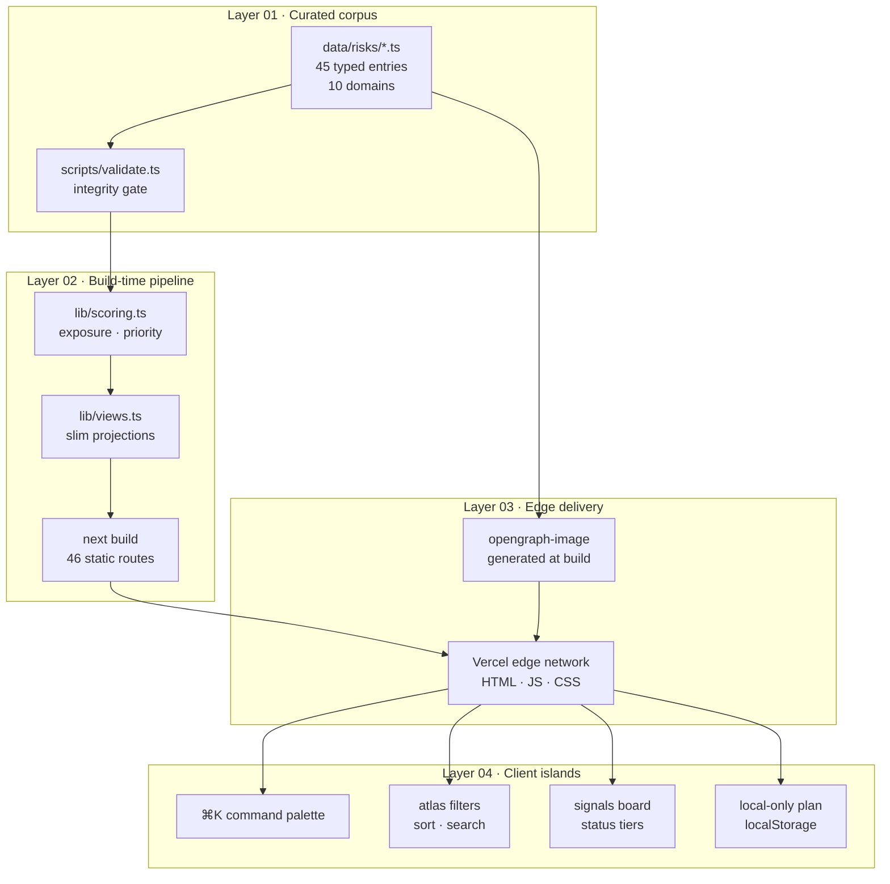
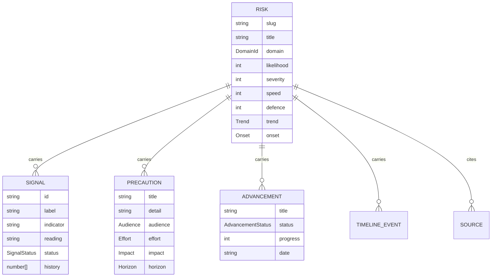
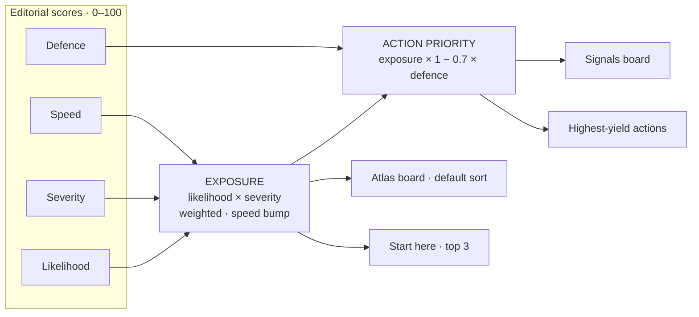

<div align="center">


# Tripwire

**An atlas of everything that could go wrong** — with the warning signs we can measure,
the precautions that actually help, and the mitigations that are genuinely working.

[](https://tripwire-atlas.vercel.app)
[](https://github.com/aniruddhaadak80/tripwire)
[](https://github.com/aniruddhaadak80/tripwire/blob/main/LICENSE)
[](#corpus)

</div>

---

## What this is

Tripwire is a curated, public-good reference for **failure modes** — the ways the world could
reasonably go wrong in the next few decades. It covers the slow physical systems (climate,
pandemics, orbit), the fast technological ones (AI, cyber), the structural ones (finance,
information, infrastructure) and the personal ones you can actually do something about this
quarter.

Every entry carries the same four things:

| | |
|---|---|
| **Warning signs** | Measurable indicators with current readings, cadence and history — not vibes |
| **Precautions** | Split by who has to act: you, your organisation, or policy |
| **Advancements** | Mitigations scored honestly, including the ones that stalled or regressed |
| **Scoring** | Exposure and action priority, defined and reproducible |

No doom-scrolling, no complacency, no paywall. No accounts, no tracking, no API keys.

## Screenshots

<table>
<tr>
<td width="50%">


</td>
<td width="50%">


</td>
</tr>
<tr>
<td width="50%">


</td>
<td width="50%">


</td>
</tr>
<tr>
<td width="50%">


</td>
<td width="50%">


</td>
</tr>
</table>

## Corpus

| | |
|---|---|
| **45** | failure modes |
| **10** | watch domains |
| **180** | early-warning indicators with history |
| **311** | precautions (189 for individuals) |
| **225** | tracked mitigations |
| **267** | timeline events |
| **244** | primary sources |

<div id="corpus"></div>

Domains, mean exposure and their loudest entry:

| Domain | Entries | Mean exposure | Loudest entry |
|---|---|---|---|
| Machine Intelligence | 6 | 51 | Evaluation gaming and ginned benchmarks |
| Climate & Earth Systems | 6 | 63 | Runaway heat domes |
| Biology & Pandemics | 3 | 64 | Antimicrobial resistance |
| Cyber & Infrastructure | 5 | 85 | Ransomware as an infrastructure outage |
| Nuclear & Material Risk | 3 | 34 | Miscalculation and false alarm escalation |
| Financial System | 5 | 67 | Liquidity fragility and the speed of contagion |
| Information & Society | 4 | 82 | Synthetic evidence and the death of the visual record |
| Physical Infrastructure | 4 | 68 | Grid overload and cascading failure |
| Orbit & Space Weather | 3 | 55 | GNSS interference and navigation denial |
| Personal Exposure | 6 | 58 | Identity theft |

## Features

- **The atlas** — every entry, filterable by domain, band and free text, sortable by exposure or
  action priority. `/atlas`
- **Signals board** — all 180 indicators ordered by how loud they are, each with its measurement
  method, current reading and sparkline history. `/signals`
- **Preparedness** — every individual-level precaution pulled into one checklist with a readiness
  score, cadence-aware grouping, Markdown export and copy-summary. Runs entirely in your browser.
  `/prepare`
- **Deep dives** — radar profile, warning signs, precautions by audience, mitigation maturity,
  timeline, connected risks and primary sources. `/risk/[slug]`
- **⌘K command palette** — search across risks, indicators, precautions and mitigations
- **Method page** — the full scoring model, editorial rules and stated limits. `/method`
- **Static everything** — 46 prerendered pages, no backend, no database, no keys

## Architecture




## Data model




## Scoring




```
exposure        = likelihood × (0.62 + 0.38 × severity) × speed bump (≤ 12%)
action priority = exposure × (1 − 0.7 × defence)
```

- **Likelihood** — chance it bites within about ten years
- **Severity** — worst-case damage
- **Speed** — how fast it hits once triggered
- **Defence** — how well we are doing (higher = better)

Exposure alone builds a bad queue: it buries risks we have genuinely mitigated. Action priority
discounts exposure by current defence, which surfaces the **dangerous-and-ignored** — the list
worth working through. Bands: critical ≥ 72 · elevated ≥ 56 · watch ≥ 40.


## Getting started

```bash
bun install
bun run dev        # http://localhost:3000

bun run build      # production build (46 static routes)
bun run start      # serve the build
bun run lint       # eslint
bun run typecheck  # tsc --noEmit
bun run validate   # data integrity gate
```

### Screenshots

```bash
bun run shots       # capture production pages → public/screenshots/*.png
bun run shots:web   # compress to web-friendly *.jpg
```

## Project structure

```
tripwire/
├── app/                    # routes
│   ├── page.tsx            # home: index, domains, signals, priority, advances
│   ├── atlas/              # filterable board
│   ├── signals/            # indicators ordered by loudness
│   ├── prepare/            # local-only preparedness plan
│   ├── method/             # scoring model, editorial rules, limits
│   ├── risk/[slug]/        # 45 deep-dive pages
│   ├── opengraph-image.tsx # generated OG image
│   ├── sitemap.ts · robots.ts
│   └── icon.svg            # favicon
├── components/             # UI islands
│   ├── command.tsx         # ⌘K palette + provider
│   ├── atlas-board.tsx     # filter/sort grid
│   ├── signals-board.tsx   # status-tier board
│   ├── prepare-board.tsx   # checklist + readiness gauge
│   ├── risk-card.tsx       # atlas card + row
│   ├── precaution-panel.tsx# you/org/policy tabs
│   ├── charts.tsx          # sparkline · radar · meter · gauge
│   └── section.tsx nav.tsx footer.tsx atmosphere.tsx reveal.tsx
├── data/
│   ├── domains.ts          # 10 domains with accents
│   ├── index.ts            # aggregation
│   └── risks/*.ts          # the corpus (one file per domain)
├── lib/
│   ├── types.ts            # Risk · Signal · Precaution · Advancement
│   ├── scoring.ts          # exposure · priority · bands
│   ├── views.ts            # slim client projections
│   ├── search.ts           # ⌘K index + ranking
│   └── plan.ts             # localStorage plan store
├── scripts/
│   ├── validate.ts         # integrity gate (run in CI)
│   ├── screenshots.ts      # real Chrome captures
│   └── compress-shots.ts   # PNG → JPG
└── public/
    ├── banner.svg · icon.svg
    ├── diagrams/           # architecture · scoring · data model · domain map
    └── screenshots/        # home · atlas · signals · prepare · method · risk
```

## Deployment

The site is fully static — any host works.

**Vercel (current):**

```bash
vercel --prod
```

**Any static host:**

```bash
bun run build
# upload .next/static + app HTML, or use `next start` behind a reverse proxy
```

Environment variables: none required. `NEXT_PUBLIC_SITE_URL` overrides the canonical domain
(defaults to the production URL).

## Contributing

Content corrections are the most valuable contributions — a better indicator, a more honest status
on a mitigation, or a source that actually supports a claim.

1. Fork, branch, edit one or more files in `data/risks/`
2. Run `bun run validate` — it fails on dangling links, out-of-range scores and thin entries
3. Run `bun run typecheck && bun run lint`
4. Open a PR: what changed, why, how to test

Editorial rules (enforced in `/method`): estimates never predictions · no invented precision ·
optimism is recorded not hidden · every claim links out · personal means personal.

See [CONTRIBUTING.md](https://github.com/aniruddhaadak80/tripwire/blob/main/CONTRIBUTING.md) and
the issue templates: **content correction**, **new risk proposal**, **bug report**.

## Roadmap

- [x] 45 entries · 10 domains · 180 signals · 311 precautions
- [x] Local-only preparedness plan with readiness score
- [x] ⌘K command palette, signals board, method page
- [x] Generated OG image, sitemap, robots, canonicals
- [x] Real screenshots + architecture/scoring/data-model diagrams
- [ ] Weekly signal-refresh cadence (indicator readings pulled from cited sources)
- [ ] Email/Atom digest of the week's loudest signals
- [ ] Per-risk "what would change my score" — counterfactual editor for policy options

## License

MIT — see [LICENSE](https://github.com/aniruddhaadak80/tripwire/blob/main/LICENSE).

Not medical, legal, or financial advice. Estimates, not predictions.
